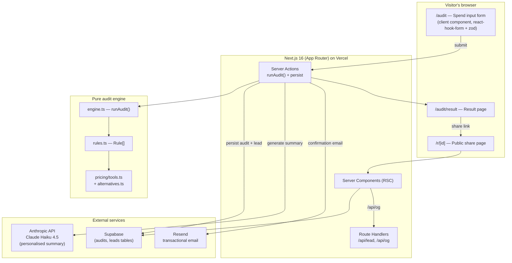

# Architecture

## System diagram

## Data flow: how an audit becomes a result

1. **Visitor lands on `/`** — server-rendered marketing page with cited stats.
2. **Visitor opens `/audit`** — client component for the multi-tool form (Phase 2). Form state persists in `localStorage` keyed by `tokentally:draft:v1` so refreshes don't lose work.
3. **Visitor submits** — a Next.js Server Action receives the typed payload (validated with Zod), calls `runAudit()` from `src/lib/audit/engine.ts`. The engine is a pure function; it returns deterministically without touching any external service. This is why it can be unit-tested in isolation.
4. **Server Action persists the audit** — writes a row to `audits` in Supabase (audit input + computed result + a generated `id`). Returns the `id` to the client.
5. **Visitor sees the result page** — `/audit/result?id=...` reads the audit back from Supabase by id (server component, cached short-term).
6. **Visitor opts to receive the report by email** — submits an email + optional fields. Server Action writes a `leads` row, calls Resend to send the confirmation.
7. **Visitor shares the link `/r/[id]`** — that route renders the same audit but strips PII (no email, no company name) and emits a dynamic OG image via `/api/og`.

## Why this stack

- **Next.js 16 App Router on Vercel** — server actions remove the boilerplate of a typed JSON API for a one-page submission, and metadata-based OG / Twitter card generation is built in. Single deploy target.
- **TypeScript + Zod** — the engine's input shape is small and fixed; Zod gives me runtime validation on the server-action boundary for free, and TypeScript covers the rest.
- **Tailwind 4 (no config file)** — the design system lives in `globals.css` under `@theme`. Faster to iterate than CSS-in-JS and avoids the JS runtime cost.
- **Supabase** — Postgres + an RLS-friendly client + a service-role server key for the route handlers. RLS lets `/r/[id]` read public-safe columns directly without a server hop. We control schema migrations via the SQL editor / migrations folder.
- **Resend** — the simplest API for transactional email; pairs naturally with React Email for templating (Phase 4).
- **Anthropic Claude Haiku 4.5 for the summary** — Haiku is fast and cheap enough that the page renders without the user noticing; if the call fails or times out, we fall back to a templated string. The full prompt + design notes live in `PROMPTS.md`.

## What I'd change if this had to handle 10k audits/day

10k/day ≈ 7 audits/min average, with bursty peaks during weekday US business hours of maybe 30/min. The current shape mostly holds, with these specific changes:

1. **Cache the audit engine output by input hash.** `runAudit` is pure, so identical inputs produce identical results. Hash the canonicalised `AuditInput` and store in Upstash Redis with a short TTL (24h). This collapses bursts from the same campaign or share-link traffic onto a single execution.
2. **Move LLM calls to a queue.** Right now the Anthropic call blocks the response. At 10k/day with 2-second p50 latency you'd burn worker time and concurrency limits. Push summary generation to a Vercel queue (or a Trigger.dev job) and stream the text in via Server-Sent Events as it completes — the rest of the page renders immediately.
3. **Switch lead/email writes to a background queue.** A failed Resend call shouldn't fail the user-visible audit. Today it's all in the same server action; production should write the lead synchronously, then enqueue the email send and the consultation-trigger webhook.
4. **Promote OG image generation to ISR.** `/api/og` for `/r/[id]` should be cached per-id at the CDN edge — there are far more shares than fresh audits.
5. **Per-IP and per-email rate limits, not just honeypot.** Phase 4 ships with a honeypot field (zero-friction, zero false positive); 10k/day means we'd need a per-IP token bucket via Upstash to absorb hostile traffic. The honeypot stays as a first line.
6. **Add an `audits.public_payload` column** generated by a Postgres trigger that strips PII from the input and result. Today, the public share route does the strip in JS; at scale, denormalising it into the row removes one place where a leak could happen.
7. **Pricing data refresh job.** Today `tools.ts` and `PRICING_DATA.md` are hand-verified. At scale we'd want a weekly GitHub Action that scrapes each pricing page, diffs against the registry, and opens a PR for human review. Pricing changes silently is the single biggest correctness risk.
